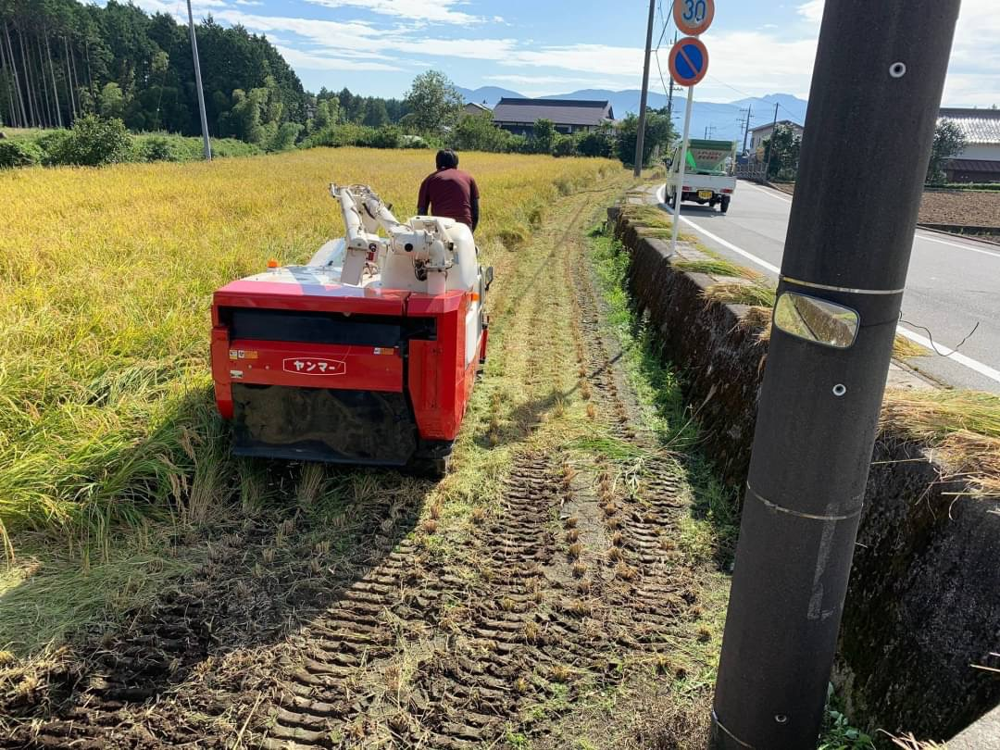

# シンプル・スピード　 Qin 農業

## 農業 × エンジニア

エンンジニアが農業にできること

提案先: みっきー　プロジェクトリーダーゆーこ　まさき  
提案者: せり  
2021 年 2 月 23 日
提案番号:1

# 「農業」の課題を解決するプロダクト

## 農業の流通と経営にまつわる課題を解決する

スクラムマスター みっきー  
セカンドマスター　ゆーこ
プロダクト|オーナー
-|-
デザイン|ひよこ
エンジニア|丸本
データ解析|
現地調査|せり
先行事例調査|まさき

---

## 開発サイクル

| 毎週日曜 |            | レトロスペクティブ（振り返り） |
| -------- | ---------- | ------------------------------ |
| 毎朝     | 6:15〜6:15 | デイリースクラム               |
| 日曜     | 30m        | 研修                           |

---

## 開発ロードマップ

1. キックオフ(3 月第 1 週目)  
   今後の進め方について
1. プロダクトビジョンの決定
1. 農家の課題、問題点（仮説）の検証
1. 事前調査内容の決定
1. ユーザーストーリーの作成
1. ユーザーストーリーマッピング
1. 開発着手(4 月)
1. v0.0.0 リリース(7 月)
1. ユーザーストーリーの見直しと消化、プロダクトの修正

- ゴール  
  農業の流通と経営にまつわる課題を解決するプロダクトをリリースする

---

# キックオフ

- Sketch や Figma などのデザインツールでどなたかにデザインしてもらったものをもとにフロントのデザイン開発を進めます
- Github を用いたチーム開発を実施します（Github にリポジトリを作り、develop ブランチを作成。develop ブランチから各作業ブランチを作成。issue に紐づけてプルリクエストを作成し、レビューをもらったら develop から master にマージとします。）
- 週に 1 度アジャイル開発に関する 30 分の勉強会を私が実施します。（私も 1 から学びながらなのでこの勉強会は自転車操業的な感じで進みます

#

- 誰の何を解決するか
- どのように解決するか
- ユーザーストーリーマッピングをどう作るか
